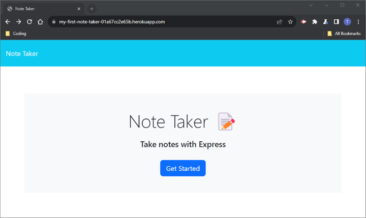
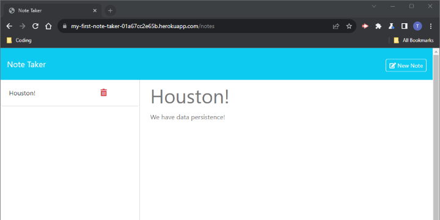

# Note Taker
>(```note-taker``` - Module 11 Challenge) 

A simple web-app to take and store personal notes that persist upon reload and across devices.

## Description
- This application allows you to enter and save notes for yourself (or other lucky people with access to the URL) that persist upon closing, reloading, and across devices!
- It is written in JS using the [Node.js](https://nodejs.org/en) runtime environment, leveraging [Express v4.18.2](https://www.npmjs.com/package/express/v/4.18.2) for the web framework/server-functionality, and was deployed using [Heroku](https://heroku.com/).
    - Additionally, this app makes use of [uuid v9.0.1](https://www.npmjs.com/package/uuid/v/9.0.1) for the creation of and assignment of v4 **Universally Unique IDentifiers** (UUID) to objects in the database.

## Installation
- No installation is necessary, simply visit the deployed app at &rarr; [this link](https://my-first-note-taker-01a67cc2e65b.herokuapp.com/) &larr;.

## Usage
To use the application:
1. Follow the link above, and you will land on the homepage:  

2. Click 'Get Started', and you will be redirected to the [/notes](https://my-first-note-taker-01a67cc2e65b.herokuapp.com/notes) page. If no notes have been created yet, the page will look like this:  

    - If notes already exist, you will see them in the left-hand column; see screenshots below for reference.
3. To add a new note, type the title and text of your note in the respective 'Note Title' and 'Note Text' fields. Two new buttons will appear in the top right:  
  
    - Click 'Clear Form' to clear your entry and start again, or;
    - Click 'Save Note' to save your note. Tt will now appear in the column on the left (see screenshot below).
4. Click on an existing note to see the contents of it on the right-hand side:  

5. To add an additional note, click on the 'New Note' button in the top-right (visible in the screenshot above) and repeat Step 3.
6. To delete a note, click on the red 'Trash-Bin' icon next to the note you wish to delete.  

## Tests 
- No tests have been written for this application.

## Roadmap / Known Bugs
The following is a non-exhaustive list of known bugs or items I would like to address with more development time in the future:

### Bugs
- UI Bug: When 'No saved Notes' is clicked from the list on the left it renders the 'Clear Button' inoperable.
    - The Clear Button still disappears when clicked, but it does not clear the contents of the form.
    - This can be escaped by refreshing the page. Manually clearing the field or saving a note will not fix the Clear Button functionality.
    - See [/issues](https://github.com/trnigg/note-taker/issues) for more information.

## License / Credits
- This project is licensed under the [MIT License](https://choosealicense.com/licenses/mit).
    - Please refer to the [license](./LICENSE) section in the repo for further information.  

- The entirety of the front-end consists of starter-code that was supplied as part of coursework.  

- Please see the [Description](#description) section for an overview of 3rd-party packages/modules used in this app.  

## Questions
- For any questions, issues or feedback, please reach out to me on GitHub at [trnigg](https://github.com/trnigg/).